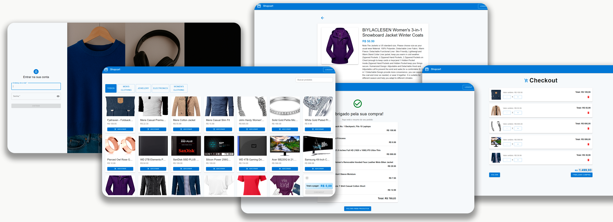

# project-shopcart

Um projeto de loja online feito com React e Vite, com funcionalidades de carrinho de compras, checkout e gerenciamento de produtos.



## 🌐 Acesse o Projeto

[](https://project-shopcart-self.vercel.app/)


## 🚀 Tecnologias usadas

- React
- Vite
- Material UI (MUI)
- React Router
- Context API para gerenciamento de estado do carrinho

## 🎯 Funcionalidades

- Listagem de produtos
- Adicionar, remover e alterar quantidade no carrinho
- Checkout com resumo dos itens e total
- Navegação entre páginas
- Layout responsivo para mobile e desktop

## 💻 Como rodar o projeto localmente

1. Clone o repositório:

   ```bash
   git clone https://github.com/wendelveloso/project-shopcart.git
   cd project-shopcart

   ```

2. Instale as dependências:

    ```bash
    npm install
    ```

3. Rode o projeto em modo de desenvolvimento:

    ```bash
    npm run dev
    ```

## 🤝 Contribuindo
Pull requests são bem-vindos! Para mudanças grandes, por favor abra uma issue antes para discutirmos.

## 📝 Licença
Este projeto está licenciado sob a licença MIT.